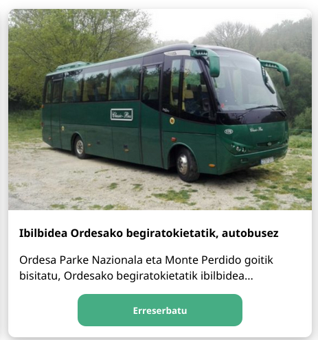

# Garapenerako ingurunea

Proiektu hau burutzeko **CSS** eta **HTML** hizkuntzak bakarrik erabili ahal genituen.

IDE gisa **Visual Studio Code** erabili dugu, web garapen esperientzia hobea izateko **Prettier** testu formateatzaile, **Live Server** eta **Markdown**-erako gehigarriekin.

Datu basea diseinatzeko **Microsoft Access** programa erabili dugu.

Webgunea desplegatzeko **Nginx** zerbitzaria aukeratu dugu.

Mapa interaktiboa **Google Maps**-en egin dugu eta irudiak **GIMP**-en editatu.

Azkenik, **Trello** plataforma erabili dugu gure artean organizatzeko eta bertsio kontrolerako **Git** softwarea, errepositorioa **GitHub**-en hosteatuz.

# Webgunea

### Egitura

- Hasierako orria
  - Aurkezpen testua
  - Aktibitate kartak
  - Mapa interaktiboa
- Aktibitateen orriak
  1. Jarduera
     - Azalpena
     - Arauak
     - Prezioa
     - Bideoa edo/eta argazkiak
  2. Jarduera
     - ...
- Dokumentazioa
  - (Ikus. horri honen indizea)

### Nabigazio barra


Nabigazio barra orri guztietan erakusten da.
Bertan klikatuz (Ezkerretik eskubira) orri nagusira, kontaktua atalera eta aktibitateen atalera birbidaltzen zaitu.

    .nav {
        position: fixed;
        top: 0;
        width: 100%;
    }

Posizio finko bat duen div bat besterik ez da.\
Barruko elementuak _unordered list_ baten barruan sartzen ditugu eta irudiko "bloke" itxura ematen diogu:

    ul {
        list-style-type: none;
        margin: 0;
        padding: 0;
        overflow: hidden;
        background-color: #393548;
    }

### Mapa


Pentsatu duguna izan da aktibitate bakoitzaren kokapena mapan jartzea eta bakoitzari kolore desberdina jartzea.

Google my maps erabili dugu, ondoren aktibitate bakoitzan kokapena. Kokapen guztiak ipini ondoren iframe etiketaren bidez mapa txertatu dugu orrian.

### Kartak


Kartak CSS-ko _grid_ baten barruan doazen elementu klikagarriak dira.\
Lehenik eta behin _grid_ klase hori sortu behar dugu:

    .cards {
        display: grid;

        grid-template-columns: repeat(4, 1fr);

        grid-auto-rows: auto;

        grid-gap: 1rem;
    }

Lau zutabeko sare bat sortu dugu eta _grid-auto-rows_ propietatearen bidez elementu gehiago sartuz gero beste lerro batean joango dira kokatzen.



```
<div class="card" onclick="location.href='aktibitateak/parkea'">
    

    <div class="card-text">
        <b>Hartz Parkea. Abentura eta dibertsioa</b>
        <p>
            Hartzak, marmotak, ahuntzak, sarrioak,
        </p>

        <div class="center">
            <button class="button">
            <span>Erreserbatu</span>
            </button>
        </div>
    </div>
</div>
```

_Card_ klaseak padding eta border batzuk besterik ez ditu.\
Karta bakoitzari _onClick()_ funtzioarekin beste orrialde batera berbideratzeko agindua ematen diogu.\
Botoia berriz klase korapilotsuagoa da, animazioa daukalako

    .button {
        width: 240px;
        background: #46ad84;
        text-align: center;
        line-height: 45px;
        border-radius: 12px;
        color: #fff;
        cursor: pointer;
        font-weight: bold;
        border: none;
    }

    .button:hover {
        animation: shake 0.82s cubic-bezier(0.36, 0.07, 0.19, 0.97) both;
        transform: translate3d(0, 0, 0);
        perspective: 1000px;
        }

        @keyframes shake {
        10%,
        90% {
            transform: translate3d(-1px, 0, 0);
        }
        20%,
        80% {
            transform: translate3d(2px, 0, 0);
        }
        30%,
        50%,
        70% {
            transform: translate3d(-4px, 0, 0);
        }
        40%,
        60% {
            transform: translate3d(4px, 0, 0);
        }
    }

Sagua gainetik pasatzerakoan hainbat transformazio egiten ditu, hau da, mugitu egiten da.

## Footer-a


Footerrean datuak eta ikonoak berriro ere grid batekin alineatu ditugu.\
Emailaren helbidea klikatuz gero momentuan mail bat bialtzeko aukera ematen du "mailto:" formatua erabili dugulako.\
Sare sozialetako ikonoak _FontAwesome_ letra-tipotik datoz.

## Jarduera orriak

Jardueraren orriak testura orientatuta daudenez web-egunkari bateko diseinuan inspiratu gara, erdian, paper itxurako lauki baten kokatzen da testua eta irudiak. Prezio aukera edo aukerak karta itxurako lauki batzutan daude ere. Bideoak Youtubetik txertatu ditugu.


# Organizazioa

## Kanban


Trello izan da organizatzeko erabili dugun baliabide garrantzitsuena, bertan garapenaren prozesu guztia ikus daiteke. Zirriborroetatik hasita azken detaileetaraino.

## Git


Git bertsio kontrolerako sistema ezagunena da. Gure arten kodea zinkronizatu eta bertsioak kontrolatzeko erabili dugu. *Repository*a GitHub plataforman hosteatuta dago.\
Aldaketak _branch_ ezberdinetan egin ditugu, bukatutakoan adar nagusiarekin elkartuz (merge).

# Datu basea

Datu basera sartzerakoan honako menu nagusi hau bistaratzen da (autoexec fitxategiaren bidez):


Bertan honako aukera hauek ditugu exekutatzeko:

- Erregistro berria sortu
- Erregistro bat eguneratu/aldatu
- Prezioak inflaziora moldatu
- Txostena bistaratu
- Datu basea gorde eta aplikaziotik irten

## Erregistroa sortzea/eguneratzea

## Prezioak inflaziora moldatzea

Gaur egun daukagun inflazioaren ondorioz garrantzitsua iruditu zaigu prozesu hau automatikoki egiteko sistema bat sortzea.\
Menu nagusiko inflazioaren programaren botoia klikatuz gero honako menu hau bistaratuko da, **parametro** honek urteko inflazioaren zenbaki dezimala hartzen du:


Sartu diogun datuarekin taulako <ins>Prezioa</ins> eremuaren balio berria **kalkutzen** du formula hau erabiliz:


## Datu basearen beste ezaugarri batzuk

- Debalde diren jarduera guztiak borratu daitezke **delete query** baten bidez. (Akzio kontsulten erronka)
- **Taldekatze** kontsulta batekin jarduerak egiteko aukeran dauden toki guztiak listatu daitezke.

# Despliegea

Windows sistemetarako oharra:

> Nginx zerbitzaria instalatzeko WSL azpisistema behar da.
> Hasteko bila ezazu "Turn Windows features on" programa bilatzailean.
> Programa ireki eta Windows Subsystem for Linux aktibatu.
> WSL-ren instalazioa burutu ostean Ubuntu distribuzia instalatu dezakezu Microsoft Storetik.

Ubuntu sistema bat dugularik, Nginx instalatu dezakegu terminalaren bidez komando hauek exekutatuz:

    sudo add-apt-repository ppa:nginx/stable

    sudo apt-get update

    sudo apt-get install -y nginx

Zerbitzaria hasteko:

    sudo service nginx start

Gure nabigatzailean **localhost:80** url sartu eta honako orri hau agertzen bada ondo joan da instalazioa:


